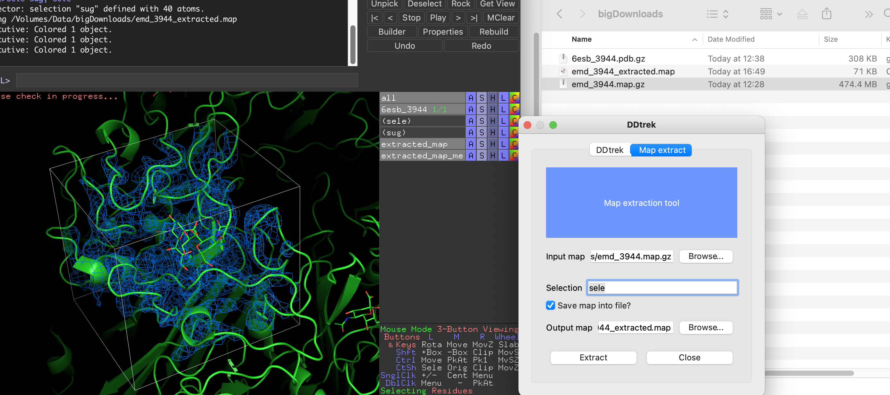

# Description
DDTREK is a script for automatic generation of PyMOL session, which will 
contain a reference structure, aligned structures 
and (optional) electron density maps for ligands.

It also includes command-line tools for map extraction from mtz or ccp4-map files.

# REQUIREMENTS:
- PyMOL version >= 2.5.0
- Input document:
    - reference structure (path to file after #REF keyword)
    - list of structures to be added to the session.
    See examples folder for details

# INSTALLATION:
- go to https://github.com/BiocrystLab/DDtrek and download the file `ddtrek.zip`
    Alternatively, use [direct link](https://raw.githubusercontent.com/BiocrystLab/DDtrek/main/ddtrek.zip)
- open PyMOL 2 (version 2.5 or higher)

 **Note**: DDtrek works in PyMOL 3 but less reliably.

- Click on the top menu "Plugin" and then on "Plugin manager".
- click on the tab "Install New Plugin", click on "Choose file..." and select the file `ddtrek.zip`

# HOW TO RUN
DDtrek could be used to align series of structures towards reference structure for analysis purposes.
Map extraction tool is similar to Coot function for saving density map fragment. It extracts a section of input map file (could be in `map.gz` format) around specified selection. Optionally, extracted map could be saved onto the disk.
To run tools use:
- GUI 
    After installation, new item 'DDtrek plugin' appears in PyMOL's 'Plugin' menu. It has two tabs, one for DDtrek and another for map extraction tool.
    - DDtrek input specified below.
    - Map extraction extracts small map fragment around specified selection:
    
- Use CLI to run ddtrek:`ddtrek ddtrek.in` to call ddtrek using input file ddtrek.in
- Use to extract map fragment: `map_extract <path to cryoEM MAP>, selection, margin`

# Input file format
DDtrek input file consists of the following lines:
- `#REF <reference.pdb>`, e.g. `#REF test.pdb` defines reference structure
- `#G <name>` defines grouping of structures
- formatted line consisting of pdb filename, (optional) mtz filename, selection identifier (at this moment chain and resi are only accepted),output name and (optional) chain in input structure, which should be used for alignment against reference structures.

See examples folder for two specific examples.

# TROUBLESHOOTING
`DDtrek` relies on user for correct formatting of input file. In case of trouble, check that input file formatted properly.

Some common errors:

- Error `Selector-Error: Invalid selection name "current_entry".` with PyMOL failing to create a new object. It is not exacly clear, what causes this error. **Solution**: close and open PyMOL, and rerun DDtrek
- Error `gemmi is not definded`: `DDtrek` attempts to install dependency automatically using `pip`. This might fail on Linux machines if user doesn't have access to PyMOL installation, e.g. when PyMOL installed using package manager. **Solution**: Ask system administrator to install `gemmi` package using `sudo pip install gemmi`
